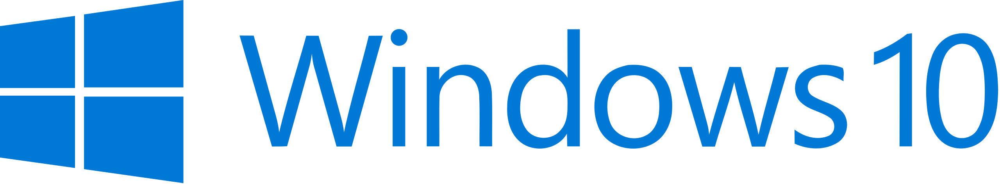

<!-- PROJECT SHIELDS -->
<!--
*** I'm using markdown "reference style" links for readability.
*** Reference links are enclosed in brackets [ ] instead of parentheses ( ).
*** See the bottom of this document for the declaration of the reference variables
*** for contributors-url, forks-url, etc. This is an optional, concise syntax you may use.
*** https://www.markdownguide.org/basic-syntax/#reference-style-links
-->

<a name="readme-top"></a>

[![LinkedIn][linkedin-shield]][linkedin-url]

<!-- PROJECT LOGO -->
<br />
<div align="center">
  <a href="https://github.com/m-abdelgawad">
    
  </a>

  <h3 align="center">Securing a Business Network</h3>
  <h5 align="center">Introduction to Cybersecurity Nanodegree - Udacity Project</h5>

</div>


<!-- TABLE OF CONTENTS -->
<details>
  <summary>Table of Contents</summary>
  <ol>
    <li>
      <a href="#about-the-project">About The Project</a>
      <ul>
        <li><a href="#built-with">Built With</a></li>
      </ul>
    </li>
    <li>
      <a href="#getting-started">Getting Started</a>
      <ul>
        <li><a href="#prerequisites">Prerequisites</a></li>
        <li><a href="#installation">Installation</a></li>
      </ul>
    </li>
    <li><a href="#usage">Usage</a></li>
    <li><a href="#roadmap">Roadmap</a></li>
    <li><a href="#license">License</a></li>
    <li><a href="#contact">Contact</a></li>
    <li><a href="#acknowledgments">Acknowledgments</a></li>
  </ol>
</details>


<!-- ABOUT THE PROJECT -->
## About The Project

![product-screenshot]

> This project was a milestone in my journey to study the Introduction 
to Cybersecurity Nanodegree provided by Udacity.

You have been hired to secure the PC used at your friend’s business: Joe's 
Auto Body. Joe provides car repair services throughout the area. His previous 
employees used it for activities unrelated to work (e.g., web browsing, 
personal email, social media, games, etc.) and he now uses it to store his 
critical business information. He suspects that others may have broken into 
it and could be using it to transfer files across the internet. He has asked 
that you secure it for him according to industry best practices, so it can be 
once again used as a standard PC.

In this project, you are given a “broken” Windows 10 PC and asked to figure 
out what’s wrong with it and then make changes to fix and secure it. The 
process of analyzing and applying security happens in workplaces around the 
globe and is exactly what cybersecurity professionals do daily. This project 
gives you the opportunity to apply what you’ve learned in the course by 
investigating a Windows 10 PC, securing it, and then explaining what you 
found and did in your security report. The same skills you use on one PC can 
be applied to thousands.

### Certification


This is my first project in the Introduction to Cybersecurity Nanodegree by Udacity. In this project, I simultate that I have been hired to secure the PC used at my friend’s business: Joe's Auto Body. Joe provides car repair services throughout the area. His previous employees used it for activities unrelated to work (e.g., web browsing, personal email, social media, games, etc.) and he now uses it to store his critical business information. He suspects that others may have broken into it and could be using it to transfer files across the internet. He has asked me to secure it for him according to industry best practices, so it can be once again used as a standard PC.

I was given a “broken” Windows 10 PC and asked to figure out what was wrong with it and then make changes to fix and secure it. The process of analyzing and applying security happens in workplaces around the globe and is exactly what cybersecurity professionals do daily.

This project gave me the opportunity to apply what I learned in the first course in the Introduction to Cybersecurity Nanodegree by investigating a Windows 10 PC, securing it, and then explaining what I found and did in my security report. The same skills I used on one PC can be applied to thousands.

<p align="right">(<a href="#readme-top">back to top</a>)</p>


### Built With

This project was developed using the following tech stacks:



<p align="right">(<a href="#readme-top">back to top</a>)</p>


<!-- GETTING STARTED -->
## Getting Started

In this section, I will give you instructions on setting up this project locally.
To get a local copy up and running follow these simple steps.

### Prerequisites

* Install windows 10 on your system

### Installation

1. Clone the repo
   ```sh
   git clone https://github.com/m-abdelgawad/securing-a-business-network.git
   ```
2. Open the following PDF in your browser or any PDF viewer:
    ```sh
    securing-a-business-network-mohamed-abdelgawad.pdf
    ```
   

<p align="right">(<a href="#readme-top">back to top</a>)</p>


<!-- USAGE EXAMPLES -->
## Usage

### Screensshots


<p align="right">(<a href="#readme-top">back to top</a>)</p>


<!-- ROADMAP -->
## Roadmap

- [x] Reconnaissance
- [x] Securing the PC
- [x] Securing Access
- [x] Securing Applications
- [x] Securing Files and Folders
- [x] Basic Computer Forensics (Advanced)

<p align="right">(<a href="#readme-top">back to top</a>)</p>

<!-- LICENSE -->
## License

Distributed under the MIT License. See `LICENSE` for more information.

<p align="right">(<a href="#readme-top">back to top</a>)</p>


<!-- CONTACT -->
## Contact

Mohamed AbdelGawad Ibrahim - [@m-abdelgawad](https://www.linkedin.com/in/m-abdelgawad/) - +201147821232 - muhammadabdelgawwad@gmail.com

Github Profile Link: [https://github.com/m-abdelgawad](https://github.com/m-abdelgawad)

<p align="right">(<a href="#readme-top">back to top</a>)</p>


<!-- ACKNOWLEDGMENTS -->
## Acknowledgments

Resources that I found helpful during the development of this project:

* [CIS-Controls-Version-7-1](https://www.cisecurity.org/controls/v7)

<p align="right">(<a href="#readme-top">back to top</a>)</p>


<!-- MARKDOWN LINKS & IMAGES -->
<!-- https://www.markdownguide.org/basic-syntax/#reference-style-links -->
[linkedin-shield]: https://img.shields.io/badge/-LinkedIn-black.svg?style=for-the-badge&logo=linkedin&colorB=555
[linkedin-url]: https://www.linkedin.com/in/m-abdelgawad/
[product-screenshot]: images/screenshot.jpg
